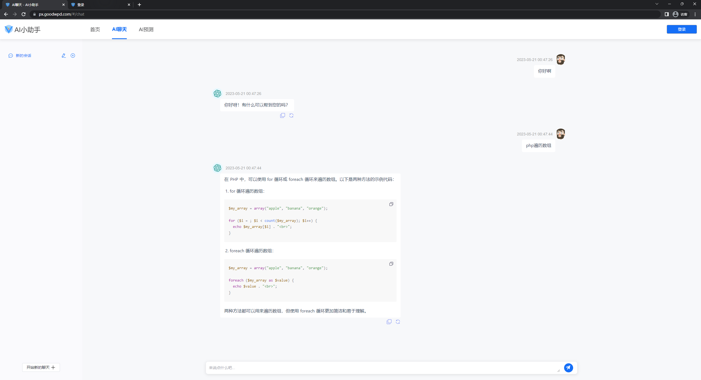
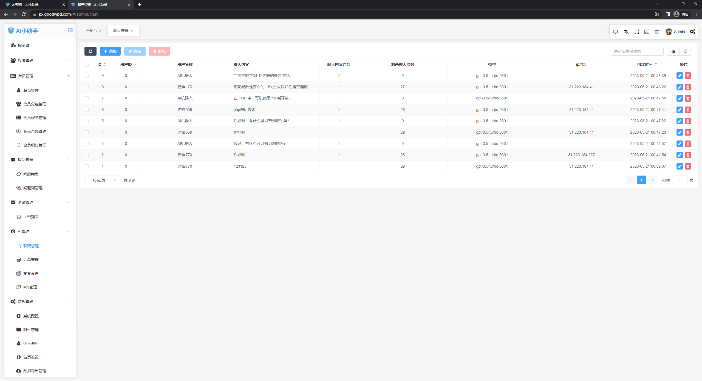
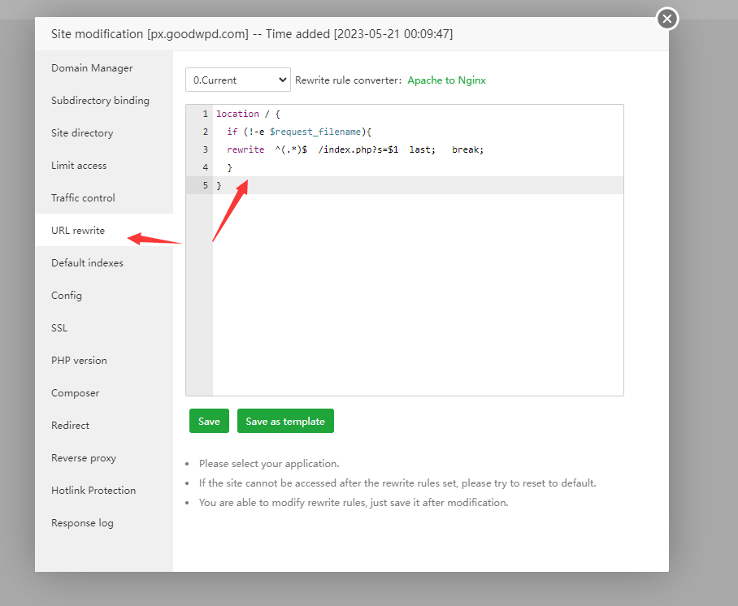
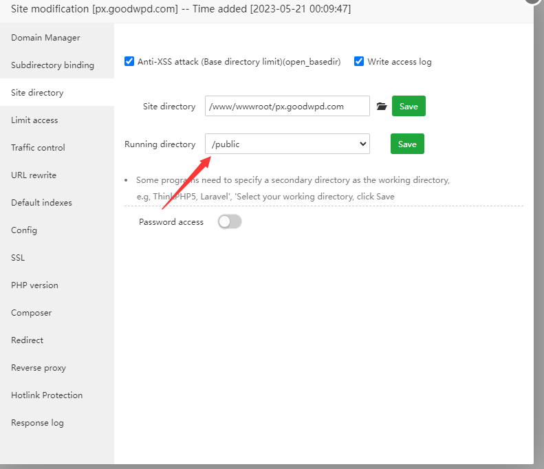

##### 安装教程

      AI小助手demo网站

      前端： https://px.goodwpd.com/#/
      后端： https://px.goodwpd.com/#/admin/   账号：demo  密码：123456

##### 演示

      
##### 网站简介

      开发语言：thinkphp6 + vue3 + ts + elements-plus
##### 网站功能  

      1.支持流式输出，打字机效果
      2.支持key轮询
      3.有支付功能
      4.有卡密功能
      5.国内服务器安装，支持代理
      6.markdown格式化内容，支持复制，重发
      7.支持短信注册
      ...

     各种功能请访问demo网站

##### 安装教程

      环境要求： php8.1 + nginx+ mysql 5.7

      1. 安装宝塔 ， 依次安装 php ，nginx，mysql
      2. 新建网站，上传文件至网站根目录
      3. 导入数据库
      4. 修改根目录.env 的数据库信息
      5. 增加 伪静态
      location / {
            if (!-e $request_filename){
            rewrite  ^(.*)$  /index.php?s=$1  last;   break;
            }
      }

      6. 设置public 为入口

      前端： https://你的地址/index.html#/
      后端： https://你的地址/index.html#/admin/   账号：admin  密码：123456

#### 问题解答

      1.怎么修改配置？
      2.怎么隐藏 网址的 index.html？
      3.怎么优化加载速度？
      4.怎么获得未编译源码进行二次开发？
      5.功能太少？请访问v2版本 https://kp.goodwpd.com/
      ... 
      以上各种问题可加qq群【575399817】，并私信群主解决

